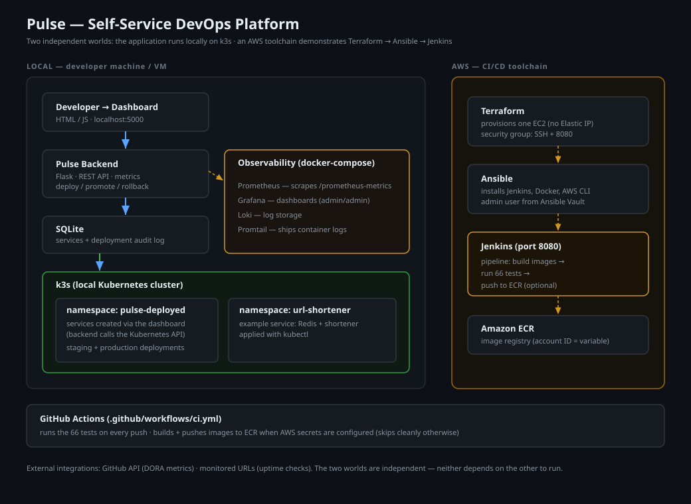

# Pulse — Self-Service DevOps Platform

Pulse is a small DevOps platform that ties together the whole delivery chain:
infrastructure is created with Terraform, configured with Ansible, builds and
tests run through a Jenkins pipeline, and the tested container image is deployed
to a local Kubernetes cluster (minikube). A web dashboard lets you deploy,
promote, and roll back services, shorten URLs, and view live monitoring.

This README is a practical guide. Follow the steps in order and it runs.

## Architecture



The short version: Terraform creates an EC2 on AWS, Ansible installs Jenkins on
it, the Jenkins pipeline builds and tests the app and packages it as an image,
and the local machine pulls that exact image and runs it on minikube. Grafana,
Prometheus, and Loki provide monitoring. The AWS side is temporary — it exists
only to build the image, and can be taken down after that.

## Ports

Once everything is running, these are the addresses:

| Service | Port | URL | Where it runs |
| --- | --- | --- | --- |
| Pulse dashboard | 5000 | http://localhost:5000/dashboard | local |
| Grafana | 3000 | http://localhost:3000 | local (docker-compose) |
| Prometheus | 9090 | http://localhost:9090 | local (docker-compose) |
| Loki | 3100 | http://localhost:3100 | local (docker-compose) |
| Jenkins | 8080 | http://&lt;ec2-ip&gt;:8080 | AWS EC2 |
| url-shortener | 30800 | via minikube NodePort | local (minikube) |

## How to run it

Tested on Ubuntu 24.04 with at least 4 GB RAM. The commands assume a
fresh machine — nothing pre-installed except git.

### Step 1 — Install the tools

Clone the repo, make the scripts executable, and install everything (Docker,
minikube, kubectl, Terraform, Ansible, AWS CLI):

```bash
git clone https://github.com/Bragashh/pulse-project.git
cd pulse-project
chmod +x *.sh
./setup.sh
```

After this, log out and back in once so your user picks up Docker group access
(or run `newgrp docker` to apply it in the current shell).

### Step 2 — Create the build server (Terraform + Ansible)

`provision-aws.sh` asks for your AWS credentials (used only for this shell
session, never written to disk), then runs Terraform to create the EC2 and
Ansible to install Jenkins on it:

```bash
./provision-aws.sh
```

> Already ran `aws configure`? Just press Enter at the credential prompt and
> your existing credentials are used.

When it finishes it prints the Jenkins URL.

### Step 3 — Run the pipeline

Open `http://<ec2-ip>:8080` and log in with **admin / admin**. Run the
`pulse-pipeline` job. It checks out the repo, runs the 66 backend tests, builds
the images, and archives the image as a downloadable artifact. The build must be
green/complete for the next step.

### Step 4 — Start the local stack

Bring up minikube, the monitoring stack, and the Pulse backend:

```bash
./start.sh
```

This starts the local environment but does not yet deploy the app — that's the
next step, which pulls the tested image from Jenkins.

### Step 5 — Deploy the tested image to minikube

```bash
JENKINS_URL=http://<ec2-ip>:8080 ./deploy-local.sh
```

This checks that the latest Jenkins build passed, downloads the image artifact,
loads it into minikube, and deploys it. Open `http://localhost:5000/dashboard` to use the app.

### Step 6 — Tear down the AWS side

```bash
cd terraform && terraform destroy
```

Do this once Step 5 is done. It's safe: the image is already loaded into your
local minikube, so the EC2 has served its only purpose (building it). Tearing it
down just stops the AWS charges — your local app keeps running. It's on a `t3.small` instance.

### Manual alternative to Step 2

If you'd rather not use the script:

```bash
export AWS_ACCESS_KEY_ID=...        # or run: aws configure
export AWS_SECRET_ACCESS_KEY=...

cd terraform
cp terraform.tfvars.example terraform.tfvars
terraform init && terraform apply

cd ../ansible
ansible-galaxy collection install -r requirements.yml
cp inventory/jenkins.ini.example inventory/jenkins.ini
JENKINS_IP=$(terraform -chdir=../terraform output -raw jenkins_ip)
sed -i "s/JENKINS_EC2_IP/${JENKINS_IP}/" inventory/jenkins.ini
ansible-playbook playbook.yml
```

## What the web application does

Open `http://localhost:5000/dashboard`. The main features:

**Deploy a service.** Enter a name, a public container image (e.g.
`nginx:alpine`), a port, and replicas, then click Deploy. Pulse calls the
Kubernetes API and creates a real deployment in minikube, tracking it from
"deploying" to "healthy". You can deploy any publicly pullable image this way.

**Promote.** Once a service is deployed to staging, promoting it runs the same
image as a parallel production deployment.

**Rollback.** Each deployment is recorded in an append-only history. Rollback
lets you pick an earlier version and redeploy that image, so you can recover from
a bad deploy without losing the audit trail.

**URL shortener.** Paste a long URL and get a short code back; the short link
redirects to the original. This panel is served by the url-shortener service that
the Jenkins pipeline built and deployed to minikube — so the dashboard is using
the exact artifact the pipeline produced. A badge shows whether the service is up.

**Monitoring buttons.** The header has Metrics and Logs buttons that open the
provisioned Grafana dashboards — request rate, latency, services monitored, and
server resources on the Metrics board; container logs on the Logs board.

**Uptime and health.** The dashboard also shows monitored-service uptime, a
server health score, and CPU/memory/disk usage, all updating live.

### Generating traffic for the graphs

To make the Grafana panels show activity, hit the endpoints continuously:

```bash
./simulate-traffic.sh        # Ctrl+C to stop
```

## Running the tests directly

```bash
cd portal/backend
python3 -m venv .venv
source .venv/bin/activate
pip install -r requirements.txt
python -m pytest -v          # 66 tests
```

## Tech stack

| Layer | Tools |
| --- | --- |
| Backend | Python 3.11, Flask, prometheus-client, kubernetes (Python client) |
| Frontend | HTML / CSS / JavaScript |
| Data | SQLite (dashboard), Redis (url-shortener) |
| Observability | Prometheus, Grafana, Loki, Promtail |
| Orchestration | minikube (local Kubernetes) |
| Containers | Docker, docker-compose |
| Infrastructure as code | Terraform (modular) |
| Configuration management | Ansible |
| CI/CD | Jenkins (pipeline on AWS) + GitHub Actions (tests on every push) |
| Tests | pytest — 66 tests covering routes, DB, deploy/promote/rollback |

## Project structure

```
pulse-project/
├── portal/
│   ├── backend/              Flask app, SQLite, deployer, metrics, tests
│   │   ├── app.py            Routes
│   │   ├── db.py             SQLite layer
│   │   ├── deployer.py       Kubernetes Python client wrapper
│   │   ├── metrics.py        Prometheus instrumentation
│   │   └── tests/            pytest suite (66 tests)
│   └── frontend/
│       ├── index.html        Dashboard
│       ├── nginx.conf        Serves the dashboard, proxies API
│       └── Dockerfile
├── kubernetes/
│   └── url-shortener/        Manifests for the example service
├── services/
│   └── url-shortener/        Flask app + Dockerfile for the example service
├── monitoring/               Observability stack (docker-compose)
│   ├── docker-compose.yml    Prometheus, Grafana, Loki, Promtail
│   ├── prometheus.yml
│   ├── promtail-config.yml
│   └── grafana/provisioning/ Auto-loaded data sources + dashboards
│       ├── datasources/datasources.yml
│       └── dashboards/       Provider config + pulse-metrics / pulse-logs JSON
├── terraform/                Infrastructure as code
│   ├── main.tf               Single Jenkins EC2
│   ├── variables.tf
│   ├── outputs.tf
│   ├── terraform.tfvars.example
│   └── modules/
│       ├── networking/       Key pair + security group (SSH + 8080)
│       └── ec2/              Instance (default public IP, clean teardown)
├── ansible/                  Jenkins provisioning
│   ├── playbook.yml
│   ├── ansible.cfg
│   ├── requirements.yml
│   ├── inventory/jenkins.ini.example
│   ├── group_vars/all.yml         (Jenkins admin user/password)
│   └── roles/jenkins/
├── .github/workflows/ci.yml  Runs the 66 tests on every push
├── Jenkinsfile               Pipeline: build → 66 tests → save + archive image
├── docs/architecture.svg     Architecture diagram
├── setup.sh                  One-time: install all prerequisites
├── provision-aws.sh          Prompt for creds → Terraform → Ansible (one command)
├── deploy-local.sh           Pull the Jenkins-tested image → deploy to minikube
├── start.sh                  Bring the local stack up
├── stop.sh                   Bring the local stack down
└── simulate-traffic.sh       Continuous traffic generation
```

---

